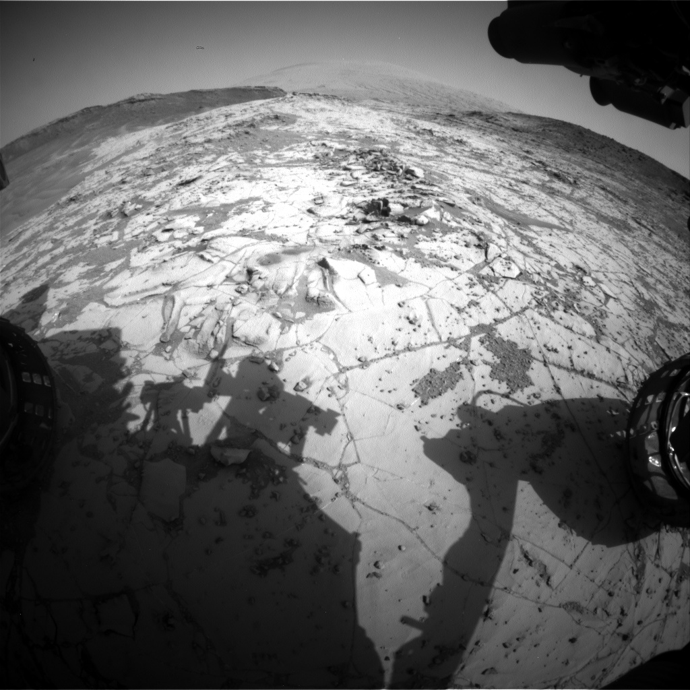

# 🚀 Mars Rover Image Viewer

This Python project uses NASA's public API to fetch and display raw images captured by the **Curiosity Rover** on Mars. Users input a Martian solar day ("sol") to request and view photos taken by the rover’s front hazard avoidance camera.

---

## 📸 Example Output



---

## 🧠 What This Project Demonstrates

- Real-world **API integration** with authentication.
- **JSON parsing** of nested responses.
- **Image downloading** and handling with `requests`.
- Image visualization using `matplotlib`.
- Simple input validation for user experience.

---

## 📁 Files Included

| File Name        | Description                                              |
|------------------|----------------------------------------------------------|
| `apiProject.py`  | Main Python script that fetches, saves, and shows image. |
| `rover.jpg`      | Sample downloaded image after script is run.             |

---

## ⚙️ How to Run

1. Clone or download the repository.
2. Navigate to the folder in your terminal.
3. Make sure `requests` and `matplotlib` are installed:
   ```bash
   pip install requests matplotlib
4. Run the script:
   python apiProject.py

🌐 API Reference
NASA Mars Rover Photos API: https://api.nasa.gov/

You must use a valid API key — the project currently uses a demo key. You can register for your own at the same link.

🧑‍💻 Author
Veer Sawhney
This project was created as part of my exploration into using real-world APIs and working with multimedia data in Python.
